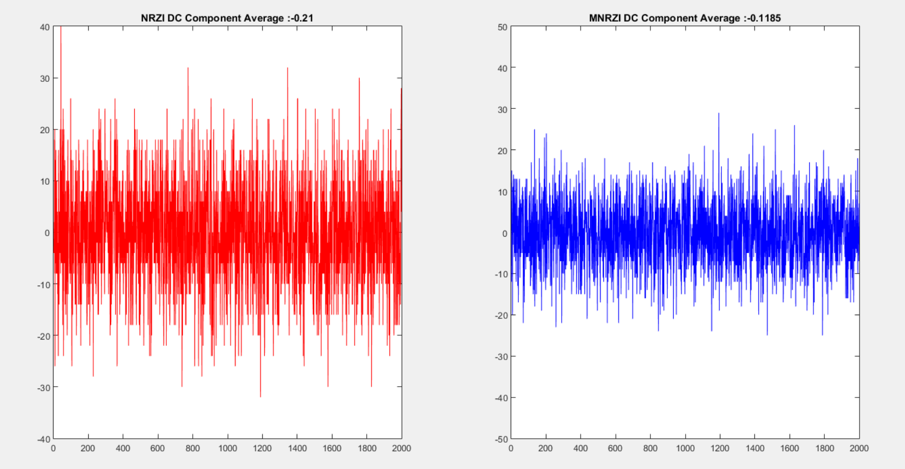
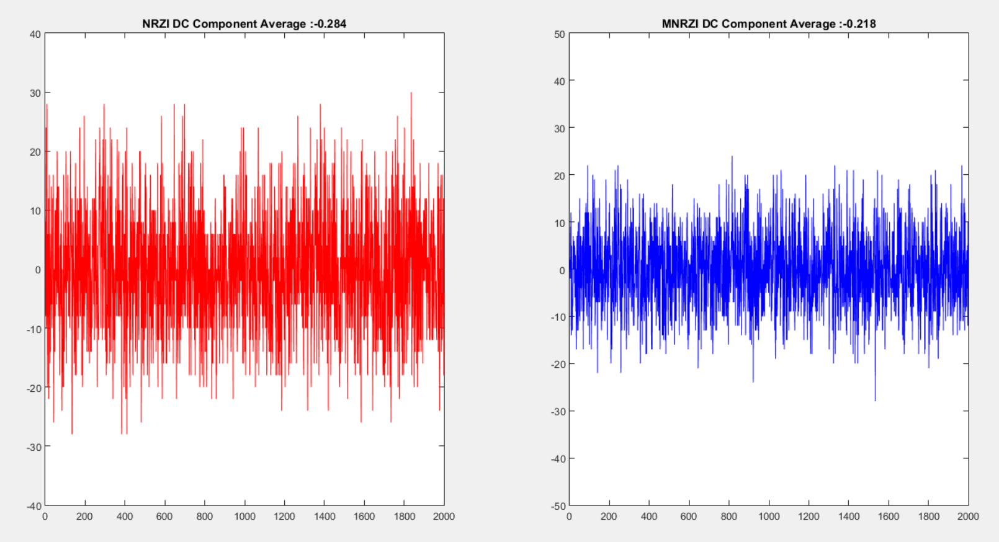
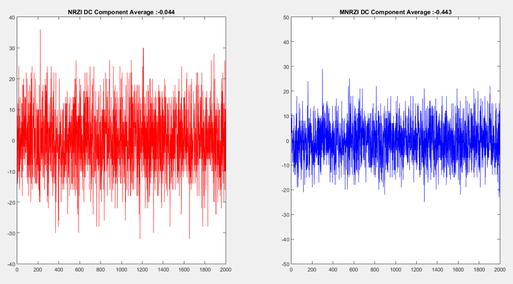
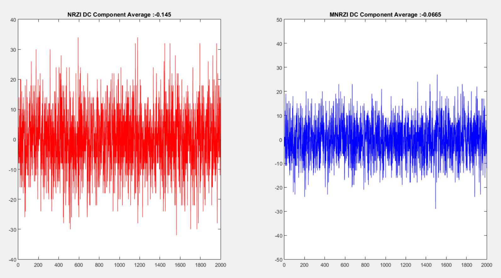
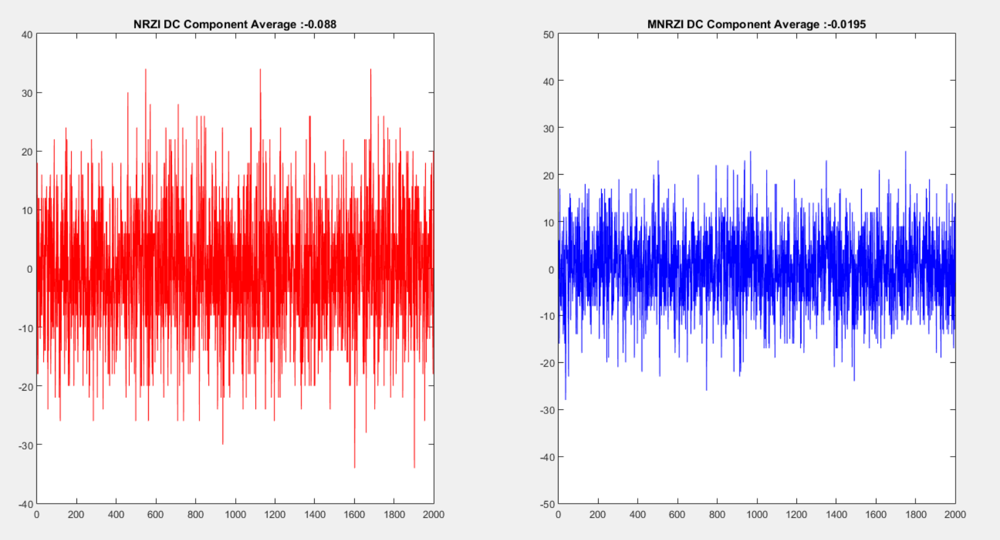

## Data Communications (CO250): Mini-Project :: Results file

We simulated the proposed method in MATLAB. The sample taken is 2000 bits string that every 
bit string length is 100 bits and they are generated randomly.Then, we plotted the average DC
component graph for both NRZ-I and MNRZ-I.We have taken into consideration 5 examples for which
the graph and table for comparison is shown below: 

